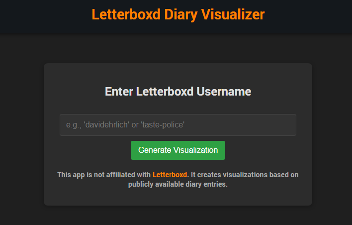

# Letterboxd Diary Visualizer

A web application that creates visualizations of a user's Letterboxd diary entries. View your movie watching habits with beautiful charts and statistics.


## Overview

Letterboxd Diary Visualizer allows users to enter their Letterboxd username and view visual representations of their movie watching habits. Since Letterboxd doesn't provide an official API, this app scrapes public diary data and transforms it into meaningful visualizations.

## Features

- Username input for any public Letterboxd profile
- Web scraping of diary entries across multiple pages
- Dark mode UI that matches Letterboxd's aesthetic
- GitHub-style contribution chart showing movies watched per day
- Support for detecting liked films and rewatches
- View movies watched on a specific day or month

## Technologies Used

- **Backend**: Node.js with Express
- **Frontend**: React.js
- **Visualization**: D3.js
- **Web Scraping**: Cheerio, Axios

## Screenshots

### Home Page


### Visualizations


## Setup and Installation

1. Clone the repository
```
git clone https://github.com/Evanomnom/letterboxd-viz.git
cd letterboxd-viz
```

2. Install dependencies
```
npm install
cd client
npm install
cd ..
```

3. Start the development server
```
npm run dev
```

This will run the server on port 5000 and the client on port 3000.

## How It Works

1. Users enter their Letterboxd username in the home page
2. The app calls the backend API with the username
3. The server scrapes diary data from all pages of the user's public Letterboxd profile
4. The data is processed and returned to the client
5. A GitHub-style contribution chart is generated using D3.js showing movie watching activity
6. Users can click on individual days or months to see the specific movies watched

## Important Notes

- **Personal Project**: This is designed as a personal project for viewing your own Letterboxd data
- **Public Profiles Only**: This application only works with public Letterboxd profiles
- **Not Affiliated**: This is not affiliated with or endorsed by Letterboxd
- **Respectful Scraping**: The app implements a delay between requests to be respectful to Letterboxd's servers

## Deployment

For personal use, you can deploy this application to platforms like:
- Heroku
- Vercel
- Netlify
- Railway

Remember to set the appropriate environment variables if needed.

## Contributing

This is a personal project, but feel free to fork it and make it your own. If you have suggestions or improvements, pull requests are welcome.

## License

MIT License 